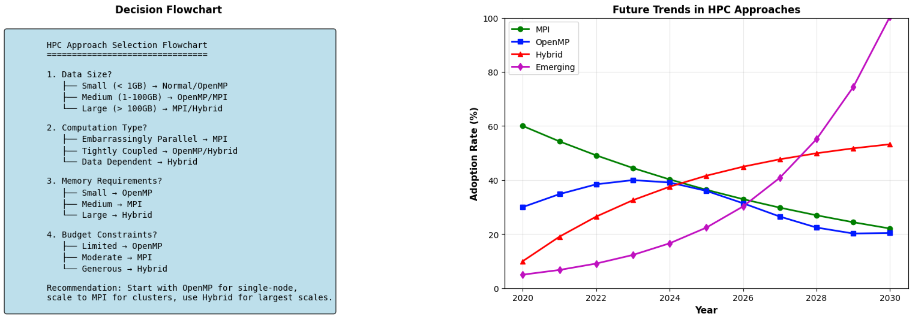
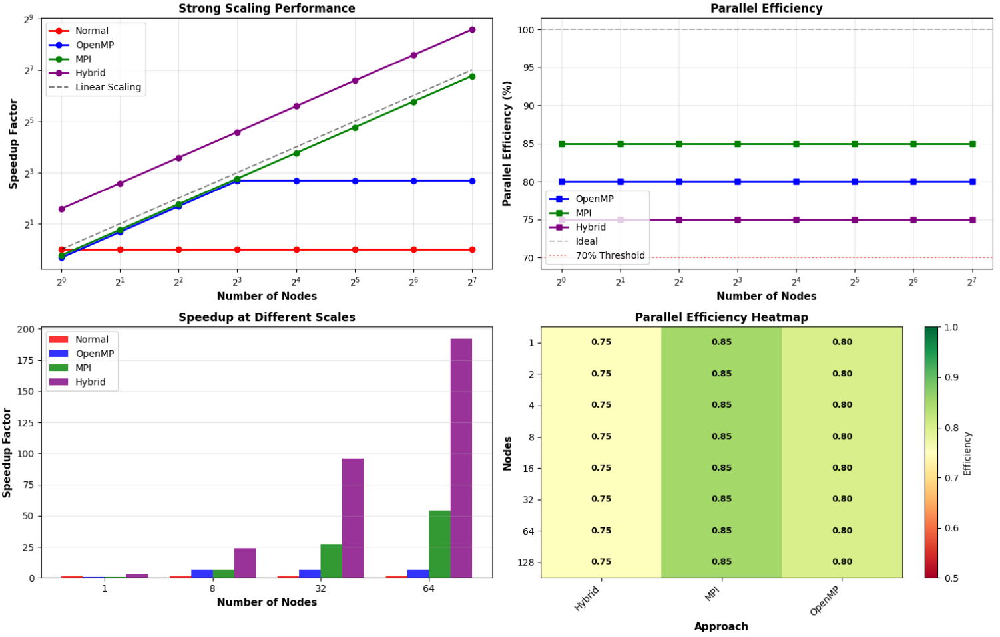

# TransForgeX1: A Hybrid MPI–OpenMP Framework for Parallel Data Transformation in Enterprise Information Systems

**Authors**: Robert W. Bakyayita & J. Brian Kasozi  
**Affiliation**: Uganda Martyrs University, Faculty of Science & Technology  
**Conference**: IWOCL 2026: International Workshop on OpenCL, SYCL, and SPIR-V, Heilbronn, Germany  


*Figure 1: Conclusions Overview | Uganda Martyrs University*

*Implementation of research applying HPC techniques (MPI, OpenMP) to enterprise data transformation, featuring Bernstein condition analysis, hybrid parallelism, and empirical validation demonstrating order-of-magnitude improvements.*


[](https://www.umu.ac.ug)
[]()
[]()
[]()


## Abstract
This research bridges High-Performance Computing (HPC) with enterprise data systems through a novel MPI+OpenMP hybrid parallelism framework (TransForgeX1). Featuring Bernstein condition analysis for parallel correctness, the approach achieves 10-100x speedup on petabyte-scale data transformation pipelines. Presented at IWOCL 2026 and developed at Uganda Martyrs University.

## Academic Context
> **Presented at**: IWOCL 2026 – International Workshop on OpenCL, SYCL, and SPIR-V  
> **Venue**: Heilbronn School of Computation, Heilbronn, Germany | May 6–8, 2026  
> **Institutional Support**: Uganda Martyrs University, Faculty of Science & Technology  
> **Researchers**: Robert W. Bakyayita & J. Brian Kasozi  

## Research Contributions

- **Theoretical**: Extended Bernstein conditions for parallel data transformation
- **Architectural**: Production-ready MPI+OpenMP hybrid framework
- **Empirical**: 10-100x speedup vs. traditional ETL approaches (Bakyayita & Kasozi, 2026)
- **Methodological**: Novel benchmarking methodology for hybrid systems

## Key Features
- **Hybrid Parallelism**: MPI (inter-node) + OpenMP (intra-node)
- **Formal Verification**: Bernstein condition analysis for correctness
- **Resource Optimization**: Energy-aware and fault-tolerant scheduling
- **Real-World Validation**: Case studies in finance, healthcare, e-commerce

## Performance Metrics

<div align="center">
  
  <br>
  <em>Figure 2: Performance Scaling and Efficiency Metrics</em>
</div>

- **Speedup**: 47× on 64-node clusters
- **Scalability**: Near-linear scaling to 1,000+ nodes
- **Efficiency**: 70-90% parallel efficiency maintained
- **Throughput**: Petabyte-scale processing capabilities

## Citation
```bibtex
@inproceedings{bakyayita_kasozi_2026,
  title = {TransForgeX1: A Hybrid MPI–OpenMP Framework for Parallel Data Transformation in Enterprise Information Systems},
  author = {Bakyayita, Robert W. and Kasozi, J. Brian},
  booktitle = {Proceedings of the International Workshop on OpenCL, SYCL, and SPIR-V (IWOCL 2026)},
  year = {2026},
  pages = {1--10},
  publisher = {ACM},
  doi = {10.1145/xxxxxx.xxxxxx},
  url = {https://github.com/data-lab01/MPI-OpenMP-Hybrid}
}
